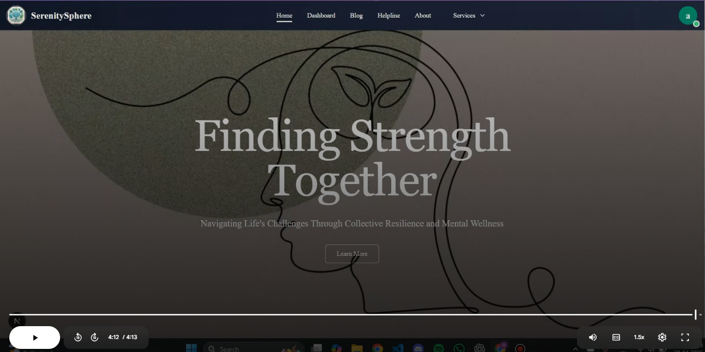

# Intra-Organizational Mental Health Care

## Addressing Unmet Mental Health Needs in Organizations

Many individuals within organizations, including schools, are grappling with unaddressed mental health challenges, despite a growing global awareness of mental well-being. The pervasive issue of limited access to adequate mental health resources significantly impacts not only personal well-being but also overall productivity and organizational effectiveness.

---

## 🎥 Watch Our Introductory Video

Learn more about the critical need for improved intra-organizational mental health care and our proposed solutions in this brief video:

*Click the image above to open/watch the video from Google Drive.*
